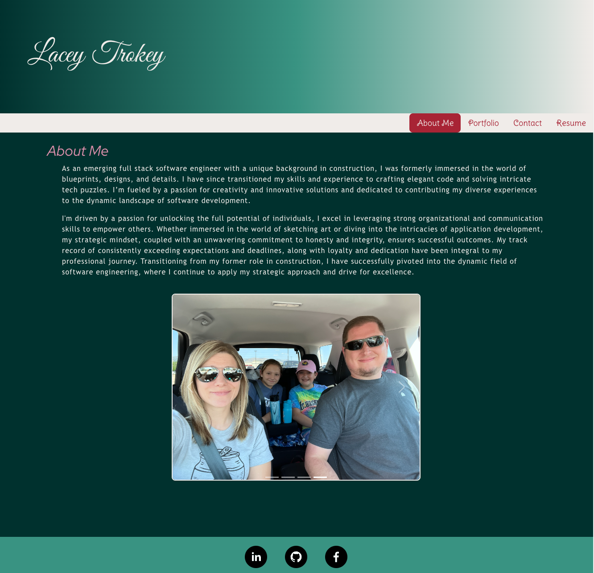
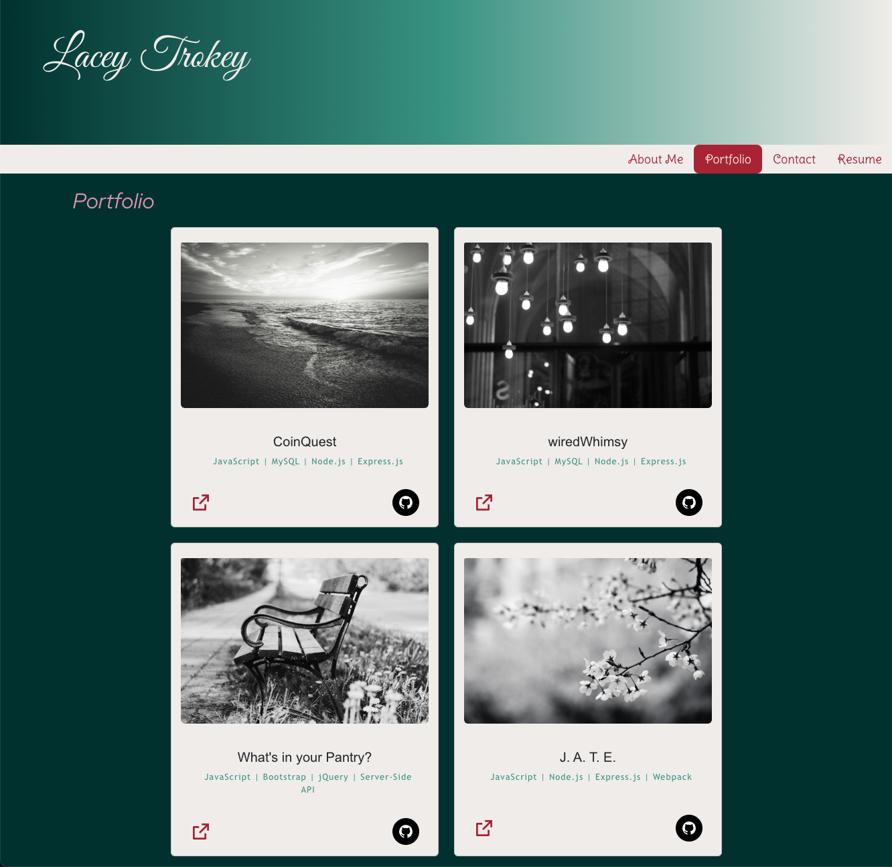
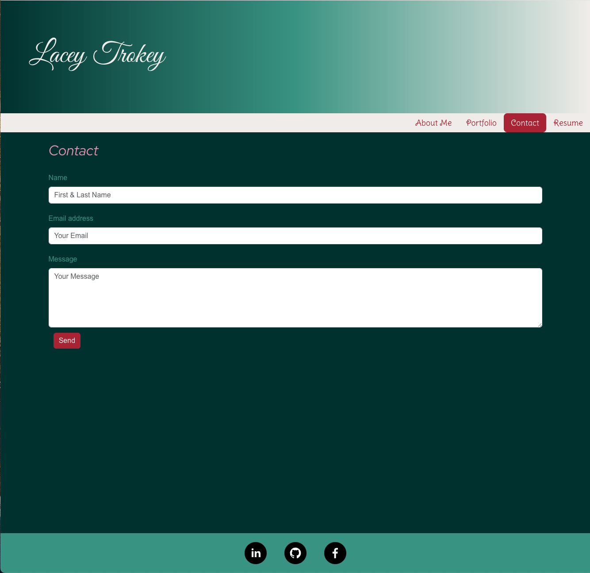
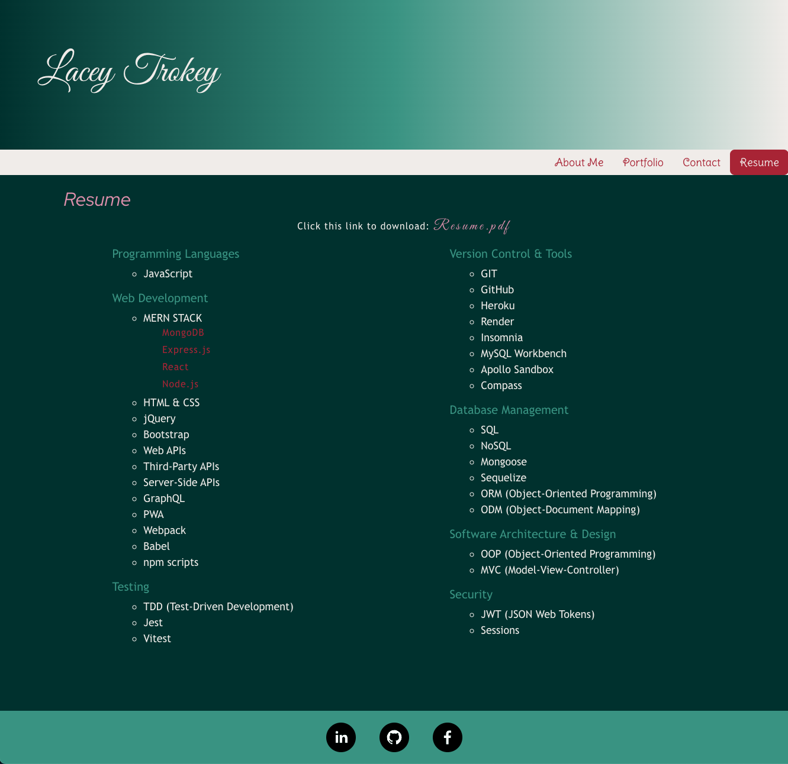

# React Portfolio

[](https://opensource.org/licenses/MIT)

[Link to live deploy](https://laceytrokeyportfolio.netlify.app)

## Description

Welcome to my portfolio, where creativity meets code! This application was crafted using Bootstrap, Vite, React, and powered by JavaScript, Node.js, and npm packages. From dynamic interfaces to seamless user experiences, each project showcases my commitment to cutting-edge technology. Connect with me through the user-friendly contact form, delve into my professional journey with the resume section, and discover the person behind the code in the "About Me" section. Thank you for visiting!

## Table of Contents

- [Installation](#installation)
- [Usage](#usage)
- [Badges](#badges)
- [Features](#features)
- [Tests](#tests)
- [Questions](#questions)

## Installation

1. **Clone the Repository**

   ```
   git clone https://github.com/ltrokey/portfoilo_react
   cd portfoilo_react
   ```

2. **Install Dependencies**

   ```
   npm i
   ```

   **Dependencies**

   - This application utilizes Node.js along with the following key dependencies:

   ```
    mysql: ^2.18.1
    bootstrap
    react
    react-bootstrap
    react-dom
    react-icons
    react-router-dom
    react-social-icons
    react-social-icons
    @testing-library/react
    @types/react3
    @types/react-dom7
    @vitejs/plugin-react
    eslint
    eslint-plugin-react
    eslint-plugin-react-hooks
    eslint-plugin-react-refresh
    happy-dom
    vite
    vitest
   ```

3. **Configuration**
   - Update the connection settings as necessary in the vite.config.js.

## Usage

1. Run the Application

   - After following the installation instructions, execute the application by running the following command:

   ```
   npm start
   ```

2. Explore Application

   **About Me:**

   Get to know the person behind the code. In the "About Me" section, I share my story, motivations, and the driving force behind my passion for web development. Discover what fuels my creativity and commitment to delivering outstanding digital experiences.

   

   **Portfolio:**

   Dive into a collection of my latest web applications, each designed to deliver seamless interactions and intuitive interfaces. From dynamic data displays to interactive features, these applications showcase my commitment to excellence.

   

   **Contact:**

   Seamless communication is just a click away with the user-friendly contact form. Whether you have inquiries, feedback, or simply want to say hello, I'm excited to hear from you. Your messages hold significance, and I look forward to developing connections and collaboration.

   

   **Resume:**

   Learn about my software engineering journey, diving into the skills, experiences, and architectures that mold my expertise. Whether you're a prospective employer seeking a closer look at my capabilities or a curious visitor interested in the intricacies of my professional background, this section offers valuable insights. Additionally, you have the convenience of downloading my complete resume for a more detailed exploration of my qualifications.

   

## Badges


## Features

- Vite Integration:

  Leveraged the power of Vite as the build tool for this web application for it's fast development server and efficient bundling capabilities to enhance the performance..

- React Router Dom:

  Implemented React Router Dom for seamless navigation. This allows users to explore different sections of my application without the need for page reloads, providing a smooth and dynamic user experience.

- React Rendering:

  Employed the power of React for rendering dynamic and interactive user interfaces. Utilizing React allows for the creation of modular and reusable components, enhancing the overall structure and maintainability of the application.

- Bootstrap Integration:

  Enhanced the visual aesthetics and responsiveness of the application through the integration of Bootstrap. Leveraged Bootstrap's extensive CSS and JavaScript components to ensure a consistent and polished look across different devices and screen sizes.

## Tests

1. Rendering Test: Contact Form

   Ensure that the contact form component renders correctly within the application.

2. Submission Test: Contact Form

   Simulate form submission with valid data and verify that the form is processed successfully.

## Questions

[GitHub Profile](https://github.com/ltrokey)

Please feel free to contact me via the email link below.

[Email](mailto:trokeyln@gmail.com)
